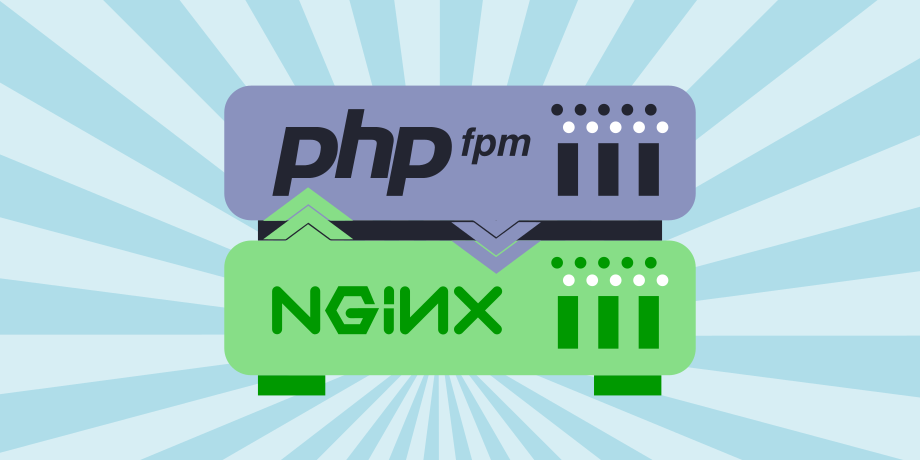
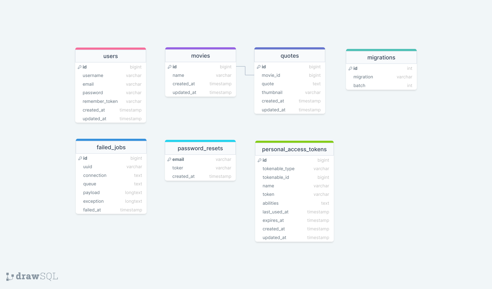

#
### Movie Quotes

"Movie Quotes" helps people to find out interesting movies, 
it generates random movies, with quotes and images, added by admins, 
if user likes generated movie, he/she can click on it where user will be redirected on the page, where can be seen all belonged quotes and images.

As mentioned above, movies are added by admins, so app has two sides, user and admins, user can see random movies and its belonged quotes and images,
on the admin side, there is admin panel, where movies and quotes with images can be seen seperately and where CRUD operations 
can be done in easy and intuitive manner (CRUD-create,read,update,delete).

User can log in as an admin from the main page if account has been created from custom artisan command, called "register:new-user".

#
### Table of content

1. [Introduction](#Introduction)
2. [Prerequisites](#Prerequisites)
3. [Tech Stack](#Tech-Stack)
4. [Getting Started](#Getting-Started)
5. [Development](#Development)
6. [Deployment](#Deployment)
7. [Resources](#Resources)

#
### Prerequisites

*  *PHP@8.0 and up*
*  *MYSQL@8 and up*
*  *npm@6 and up*
*  *composer@2 and up*


#
### Tech Stack

*  [Laravel@6.x](https://laravel.com/docs/6.x) - back-end framework
*  [Spatie Translatable](https://github.com/spatie/laravel-translatable) - package for translation
*  [Tailwindcss](github.com/tailwindlabs/tailwindcss) - css framework for styling


#
### Getting Started
1\. First of all you need to clone 'nugzar-skhiereli-movie-quotes' repository from github:
```sh
git clone https://github.com/RedberryInternship/nugzar-skhiereli-movie-quotes.git
```

2\. Next step requires you to run *composer install* in order to install all the dependencies.
```sh
composer install
```

3\. after you have installed all the PHP dependencies, it's time to install all the JS dependencies:
```sh
npm install
```

and also:
```sh
npm run dev
```
in order to build your Tailwindcss resources.

4\. Now we need to set our env file. Go to the root of your project and execute this command.
```sh
cp .env.example .env
```
And now you should provide **.env** file all the necessary environment variables:


5\. Now execute in the root of you project following:
```sh
  php artisan key:generate
```
Which generates auth key.

##### Now, you should be good to go!


#
### Development

You can run Laravel's built-in development server by executing:

```sh
  php artisan serve
```

when working on Tailwindcss you may run:

```sh
  npm run dev
```
it builds your Tailwindcss styling into executable CSS.


#
### Deployment
<br/>



<br />

- Projects first step is of course is development.
 After some time of development when you are ready to integrate and deploy your feature/fix/work you start doing these actions:
* Installing tools and programs on the server.
* Downloading the Laravel project to the server.
* PHP FPM configuration.
* NGINX configuration.
* Setting up SSL with LetsEncrypt.

After these steps everything should be OK :pray:


#
### Resources
